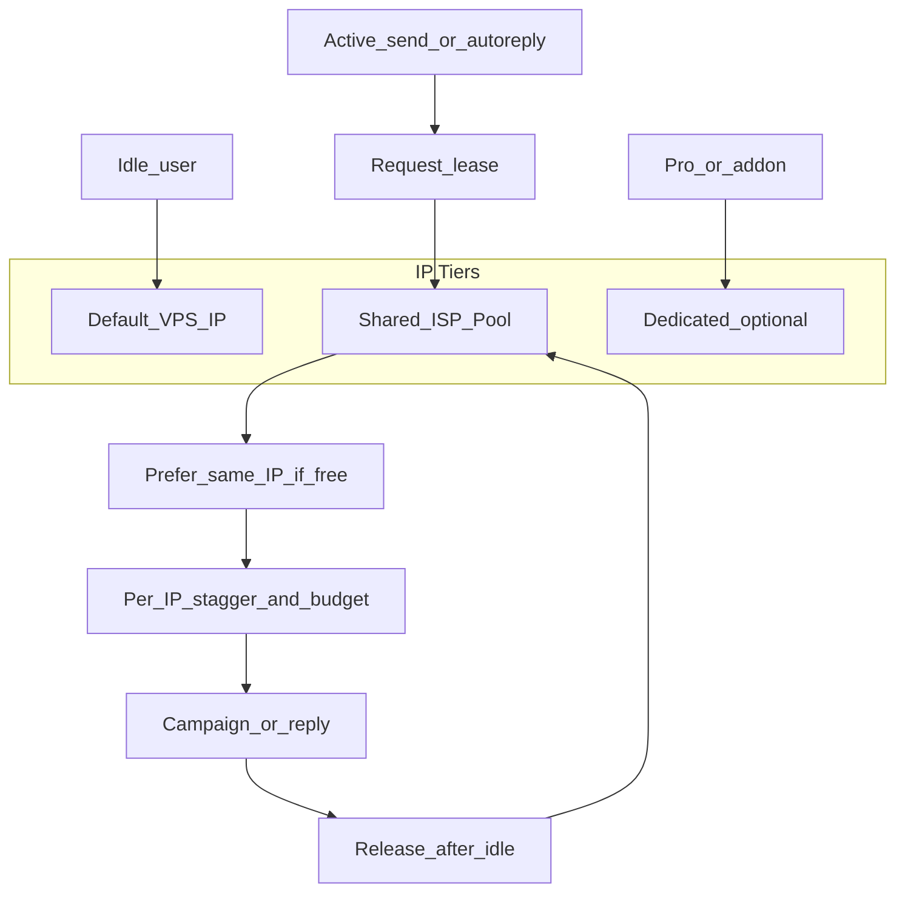

# Smart Proxy Rotate (อนาคต)

เอกสารออกแบบ — **ยังไม่ implement** จนกว่าจำนวนคนส่งจริงพร้อมกันจะทำให้ IP เครื่องอย่างเดียวเสี่ยงเกินไป

ฐานที่ต้องมีก่อน: two-tier delay (บัญชี 5 นาที / ห้อง 30 นาที) + quota แพ็ก

## ทำไมแบบนี้

- ซื้อ proxy ทีละคนตอนสมัคร = แพง (Basic 79฿) + ซื้อ/จัดการยาก
- คนส่วนใหญ่ไม่ได้ยิงทุก 5 นาทีทั้งวัน แต่พีคเช้า/เย็นอาจซ้อนกัน
- 1 IP เครื่องทั้งระบบโตไม่ได้ · 1 คน = 1 IP ไม่คุ้ม
- ทางที่สมดุล: **pool เล็ก + เช่า IP ตอนทำงาน + sticky + จำกัดพีคต่อ IP**

## สถาปัตยกรรม



### สามชั้น IP

1. **Default (IP เครื่อง)** — idle / ยังไม่ส่งหนัก / ลูกค้าน้อย
2. **Shared pool** — ISP นิ่ง ซื้อเป็นชุด (เช่น 5 → 10 → 20) คนที่กำลังส่งหรือฟัง auto-reply
3. **Dedicated** — add-on หรือ Pro ที่จ่ายเพิ่ม / บัญชีที่เคยมีปัญหาหนัก

ซื้อเป็น **ล็อกตามสเกล** ไม่ผูก signup

## กติกา lease

### ขอ IP เมื่อ

- กำลังจะส่งแคมเปญ (`next_send_at` ใกล้ถึง)
- เปิด auto-reply และมี traffic

### คืน IP เมื่อ

- ไม่มีคิวในช่วง X นาที (เช่น 15–30 นาที)
- แคมเปญหยุด / นอกหน้าต่างส่ง
- session hibernate นาน

### Sticky

- พยายามคืน **IP เดิม** ถ้าว่าง — ห้ามหมุน IP รัวกลางวัน
- ย้าย IP เฉพาะ: เริ่มวันหลัง idle นาน, pool เต็มต้องย้าย, หรือหลัง error แนว rate-limit บนเส้นนั้น

### คะแนนความต้องการ (priority)

ยิ่งสูงยิ่งได้เส้นว่าง/ดีก่อน:

- มีคิวส่งใกล้ถึง
- auto-reply เปิด + ข้อความเข้าบ่อย
- ส่งสำเร็จต่อเนื่องสูงใน 1 ชม.
- เคยเจอ rate-limit / FORBIDDEN

### เมื่อ pool เต็ม (degrade นุ่ม)

- หน่วง `next_send_at` ยาวขึ้นชั่วคราวบน IP ที่แน่น
- หรือใช้ default IP แบบจำกัดความเร็ว
- **ไม่** fail ส่งแบบเงียบ

## Per-IP safety

แม้มีหลาย IP ยังต้อง:

1. **Global stagger ต่อ IP** — ไม่ให้หลายบัญชียิงวินาทีเดียวกันบนเส้นเดียว
2. **Per-IP budget** — เช่น ไม่เกิน ~3–5 ข้อความ/นาที รวมทุกคนบน IP นั้น (ค่าจูนจาก load test จริง)
3. **Priority queue** — แพ็กสูง / คิวรอนานได้ก่อน
4. **Quarantine** — IP ที่ error ซ้ำ → แยกบัญชีหนักออก / พักเส้นชั่วคราว

## สูตรขยาย pool (ไม่ซื้อตอนสมัคร)

```
IPs ที่ควรมี ≈ จำนวนคนส่งพร้อมกันตอนพีค / 8
เป้าแชร์ไม่เกิน ~8–10 คน/IP
```

อิง **active concurrent senders** ไม่ใช่จำนวนคนสมัครทั้งหมด

| สัญญาณ | การกระทำ |
|--------|----------|
| คนส่งจริงพร้อมกันเฉลี่ย > 8× จำนวน IP | แจ้งเตือนแอดมิน ซื้อเพิ่มทีละ ~5 IPs |
| rate-limit ซ้ำบน IP เดิม | ย้ายบัญชีนั้น / กักตัว |
| ลูกค้าขอ | ขาย add-on IP ส่วนตัว |

ตัวอย่างคร่าวๆ: 100 สมัคร แต่พีคส่งจริง 15–25 คน → pool 5–10 IPs พอในช่วงแรก

## Auto-reply

- คนเปิด reply หลายห้อง = คะแนนสูง ได้ sticky นานขึ้น
- reply น้อย / นอกเวลา = คืน IP ได้
- ถ้า reply ถี่ผิดปกติบน IP เดียว → ชะลอ reply ของเส้นนั้น (ไม่ดึงแคมเปญคนบน IP อื่น)

## ข้อมูลที่ควรเก็บตอน implement

- `proxy_endpoints` — host/port/auth, geo, status, monthly cost
- `ip_leases` — `line_connection_id`, `proxy_id`, acquired_at, last_used_at, sticky preference
- metrics ต่อ IP — sends/min, errors, active accounts
- config — max accounts/IP, msgs/min/IP, idle release minutes

จุดผูกโค้ดในอนาคต: session create/resume ใน `worker-line`, send path ใน queue, admin UI ใส่รายการ proxy ด้วยมือ (ไม่ต้อง auto-buy API ตั้งแต่แรก)

## ลำดับเปิดใช้จริง

1. Ship two-tier delay + quota ก่อน (ลดพีคต่อบัญชี)
2. Monitor: concurrent senders, errors ต่อ IP เครื่อง
3. เมื่อพีคชัด → ซื้อ ISP ชุดแรก ใส่ pool + lease แบบ sticky ง่ายๆ
4. ค่อยเพิ่ม stagger/budget/quarantine และ add-on dedicated

## สิ่งที่ระบบนี้ไม่สัญญา

- ไม่กันแบน LINE 100% — ลดความเสี่ยงจากรวมโหลด
- ไม่แทน pacing ต่อบัญชี/ต่อห้อง
- Rotate บ่อย ≠ ปลอดภัยกว่า sticky บน pool ที่ถูกจำกัดพีค

## Related

- [CAPACITY.md](./CAPACITY.md) — session pool / worker limits
- [RUNBOOK.md](./RUNBOOK.md) — ops
